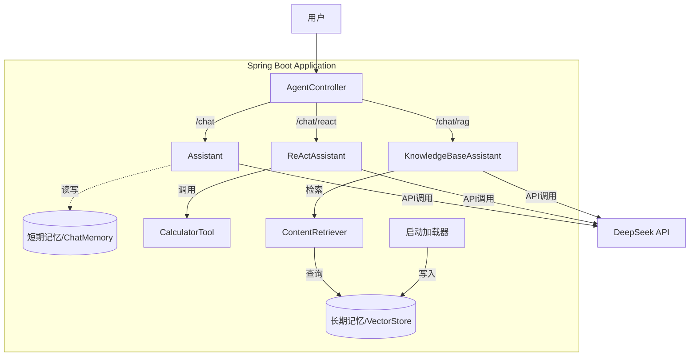

# Enterprise AI Agent Demo


[](https://github.com/your-username/ai-agent-demo/actions/workflows/maven.yml)
[](https://opensource.org/licenses/MIT)

基于 **Spring Boot** + **LangChain4j** 构建的企业级 AI Agent 示范项目。
本项目展示了如何使用 Java 技术栈构建具备 **短期记忆**、**工具调用 (ReAct)** 和 **长期记忆 (RAG)** 能力的智能应用。

## 🏗 项目架构

本项目严格遵循 [ADR-0001](docs/adr/0001-enterprise-ai-agent-framework-selection.md) 架构决策，采用以下技术栈：

*   **Framework**: Spring Boot 3.2.5
*   **AI Orchestration**: LangChain4j 0.35.0
*   **LLM Provider**: DeepSeek (通过 OpenAI 兼容接口)
*   **Embedding Model**: AllMiniLmL6V2 (本地运行，ONNX)
*   **Vector Store**: InMemoryEmbeddingStore (内存向量库)

### 📐 系统架构图



## 🚀 核心功能

本项目实现了三种不同类型的 Agent，对应不同的业务场景：

### 1. 💬 标准对话 Agent (Chat)
*   **端点**: `GET /api/chat`
*   **能力**: 具备上下文短期记忆，能进行多轮对话。
*   **实现**: `Assistant.java` + `MemoryConfig` (ChatMemory)
*   **场景**: 客服问答、通用聊天。

### 2. 🛠️ 工具增强 Agent (ReAct)
*   **端点**: `GET /api/chat/react`
*   **能力**: 能自主思考并调用 Java 方法（工具）来解决问题。
*   **实现**: `ReActAssistant.java` + `CalculatorTool.java`
*   **场景**: 复杂计算、查询数据库、操作外部系统。
*   **示例**: "计算 144 的平方根" -> 自动调用 `sqrt(144)`。

### 3. 📚 知识库问答 Agent (RAG)
*   **端点**: `GET /api/chat/rag`
*   **能力**: 基于企业私有文档（ADR）进行回答，拒绝幻觉。
*   **实现**: `KnowledgeBaseAssistant.java` + `RagConfig.java`
*   **机制**: 启动时自动加载 `docs/adr/*.md`，使用本地 Embedding 模型向量化。
*   **场景**: 内部知识问答、政策咨询。

## 🛠️ 快速开始

### 前置要求
*   JDK 17+
*   Maven 3.x
*   **DeepSeek API Key** (或其他兼容 OpenAI 格式的 Key)

### 配置
项目默认配置位于 `src/main/resources/application.properties`。
**注意**: Embedding 模型运行在本地，不需要 API Key。

### 运行
1.  设置环境变量并启动：
    ```bash
    export DEEPSEEK_API_KEY=sk-your-actual-api-key
    mvn spring-boot:run
    ```

2.  应用启动后，会自动将 `docs/` 下的文档加载到内存向量库中。

### 测试用例

| 功能 | 测试 URL | 预期结果 |
|------|---------|----------|
| **短期记忆** | `/api/chat?userId=user1&message=My name is Allen` | Agent 记住你的名字 |
| **短期记忆** | `/api/chat?userId=user1&message=What is my name?` | 回答 "Allen" |
| **工具调用** | `/api/chat/react?message=Calculate sqrt of 144` | 回答 "12" (调用了 Java 方法) |
| **知识库(RAG)** | `/api/chat/rag?message=Why choose LangChain4j?` | 基于 ADR 文档回答 (Java生态、团队技能等) |

## 📂 目录结构

```
src/main/java/com/example/aiagent/
├── AiAgentApplication.java    # 启动类
├── agent/                     # Agent 接口定义 (@AiService)
│   ├── Assistant.java              # 普通对话
│   ├── ReActAssistant.java         # 工具调用
│   └── KnowledgeBaseAssistant.java # RAG 问答
├── config/                    # 配置类
│   ├── MemoryConfig.java      # 短期记忆配置
│   └── RagConfig.java         # RAG/Embedding 配置
├── controller/                # REST 接口
│   └── AgentController.java
└── tools/                     # Agent 可用工具 (@Tool)
    └── CalculatorTool.java
```

## 📝 常见问题

*   **Q: 启动时报错 `401 Unauthorized`?**
    *   A: 请检查是否设置了 `DEEPSEEK_API_KEY` 环境变量。

*   **Q: RAG 问答为什么说不知道?**
    *   A: 确保 `docs/adr/` 目录下有文档，且应用启动日志中显示 `✅ 已将 ADR 文档加载到长期记忆中`。

*   **Q: 为什么 Embedding 不需要 Key?**
    *   A: 我们使用了 `langchain4j-embeddings-all-minilm-l6-v2`，模型直接嵌入在 Jar 包中，在本地 JVM 内运行，无需联网。
