# Enterprise AI Agent Demo


[](https://opensource.org/licenses/MIT)

基于 **Spring Boot** + **LangChain4j** 构建的企业级 AI Agent 示范项目。
本项目展示了如何使用 Java 技术栈构建具备 **短期记忆**、**工具调用 (ReAct)** 和 **长期记忆 (RAG)** 能力的智能应用。

## 🏗 项目架构

本项目严格遵循 [ADR-0001](docs/adr/0001-enterprise-ai-agent-framework-selection.md) 架构决策，采用以下技术栈：

*   **Framework**: Spring Boot 3.2.5
*   **AI Orchestration**: LangChain4j 0.35.0
*   **LLM Provider**: DeepSeek (通过 OpenAI 兼容接口)
*   **Embedding Model**: Zhipu AI (智谱) `embedding-2`
*   **Vector Store**: InMemoryEmbeddingStore (内存向量库)

### 📐 系统架构图

```mermaid
graph TD
    User[用户] --> Controller[AgentController]
    
    subgraph "Spring Boot Application"
        Controller -->|/chat| ChatAgent[Assistant]
        Controller -->|/chat/react| ReActAgent[ReActAssistant]
        Controller -->|/chat/rag| RagAgent[KnowledgeBaseAssistant]
        
        ChatAgent -.->|读写| ChatMem[(短期记忆/ChatMemory)]
        
        ReActAgent -->|调用| Tools[CalculatorTool]
        
        RagAgent -->|检索| Retriever[ContentRetriever]
        Retriever -->|查询| VectorDB[(长期记忆/VectorStore)]
        
        Ingestor[启动加载器] -->|写入| VectorDB
    end
    
    ChatAgent & ReActAgent & RagAgent -->|API调用| DeepSeek[DeepSeek API]
    Ingestor -->|API调用| Zhipu[Zhipu Embedding API]
```



## 🚀 核心功能

本项目实现了三种不同类型的 Agent，对应不同的业务场景：

### 1. 💬 标准对话 Agent (Chat)
*   **端点**: `GET /api/chat`
*   **能力**: 具备上下文短期记忆，能进行多轮对话。
*   **实现**: `Assistant.java` + `MemoryConfig` (ChatMemory)
*   **场景**: 客服问答、通用聊天。

### 2. 🛠️ 工具增强 Agent (ReAct)
*   **端点**: `GET /api/chat/react`
*   **能力**: 能自主思考并调用 Java 方法（工具）来解决问题。
*   **实现**: `ReActAssistant.java` + `CalculatorTool.java`
*   **场景**: 复杂计算、查询数据库、操作外部系统。
*   **示例**: "计算 144 的平方根" -> 自动调用 `sqrt(144)`。

### 3. 📚 知识库问答 Agent (RAG)
*   **端点**: `GET /api/chat/rag`
*   **能力**: 基于企业私有文档（ADR）进行回答，拒绝幻觉。
*   **实现**: `KnowledgeBaseAssistant.java` + `RagConfig.java`
*   **机制**: 启动时自动加载 `docs/adr/*.md`，调用智谱 Embedding API 向量化并存入内存。
*   **场景**: 内部知识问答、政策咨询。

## 🛠️ 快速开始

### 前置要求
*   JDK 17+
*   Maven 3.x
*   **DeepSeek API Key**
*   **Zhipu AI API Key** (用于 Embedding)

### 配置与运行

1.  **克隆项目**
    ```bash
    git clone https://github.com/your-username/ai-agent-demo.git
    cd ai-agent-demo
    ```

2.  **配置密钥**
    复制示例配置文件并填入您的 Key：
    ```bash
    cp .env.example .env
    # 编辑 .env 文件，填入 DEEPSEEK_API_KEY 和 ZHIPU_API_KEY
    ```

3.  **启动应用**
    使用提供的脚本启动（它会自动处理环境变量）：
    ```bash
    chmod +x run.sh
    ./run.sh
    ```
    
    或者使用 Maven 手动启动（需确保环境变量已设置）：
    ```bash
    mvn spring-boot:run -Dspring-boot.run.jvmArguments="-DZHIPU_API_KEY=$ZHIPU_API_KEY -DDEEPSEEK_API_KEY=$DEEPSEEK_API_KEY"
    ```

4.  **验证启动**
    应用启动后，控制台应显示：
    *   `Tomcat started on port 8080`
    *   `已将 ADR 文档加载到长期记忆中`

### 测试用例

| 功能 | 测试 URL | 预期结果 |
|------|---------|----------|
| **短期记忆** | `/api/chat?userId=user1&message=My name is Allen` | Agent 记住你的名字 |
| **短期记忆** | `/api/chat?userId=user1&message=What is my name?` | 回答 "Allen" |
| **工具调用** | `/api/chat/react?message=Calculate sqrt of 144` | 回答 "12" (调用了 Java 方法) |
| **知识库(RAG)** | `/api/chat/rag?message=Why choose LangChain4j?` | 基于 ADR 文档回答 (Java生态、团队技能等) |

## 📂 目录结构

```
src/main/java/com/example/aiagent/
├── AiAgentApplication.java    # 启动类
├── agent/                     # Agent 接口定义 (@AiService)
│   ├── Assistant.java              # 普通对话
│   ├── ReActAssistant.java         # 工具调用
│   └── KnowledgeBaseAssistant.java # RAG 问答
├── config/                    # 配置类
│   ├── ChatConfig.java        # DeepSeek 模型配置
│   ├── MemoryConfig.java      # 短期记忆配置
│   └── RagConfig.java         # RAG/Zhipu Embedding 配置
├── controller/                # REST 接口
│   └── AgentController.java
└── tools/                     # Agent 可用工具 (@Tool)
    └── CalculatorTool.java
```

## 📝 常见问题

*   **Q: 启动时报错 `401 Unauthorized`?**
    *   A: 请检查 `.env` 文件中的 Key 是否正确，以及是否使用了 `./run.sh` 启动（确保 Key 被正确传递给 JVM）。

*   **Q: RAG 问答为什么说不知道?**
    *   A: 确保 `docs/adr/` 目录下有文档，且应用启动日志中显示 `已将 ADR 文档加载到长期记忆中`。同时检查智谱 API Key 是否有效。

*   **Q: 为什么这里用智谱 Embedding 而不是本地模型?**
    *   A: 我们在 [ADR-0002](docs/adr/0002-switch-to-zhipu-embedding.md) 中决定切换到云端 Embedding，以获得更好的中文语义理解能力。
